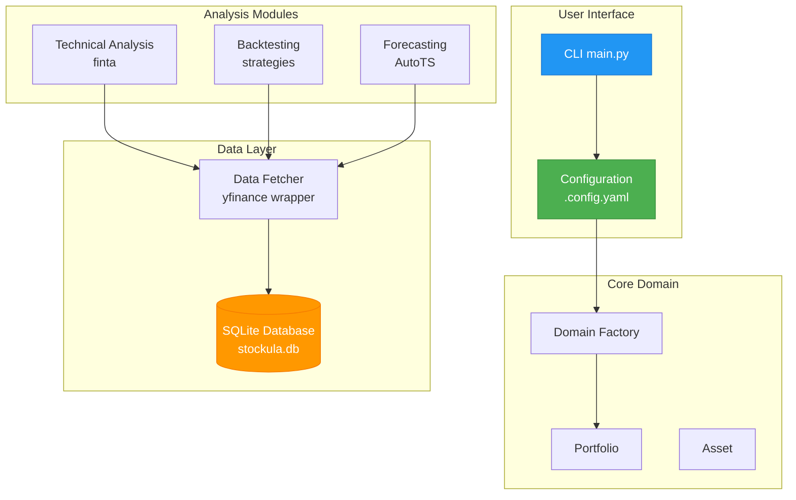

# Stockula

[](https://www.python.org/downloads/)
[](https://opensource.org/licenses/MIT)

Stockula is a comprehensive Python trading platform that provides tools for technical analysis, backtesting, data fetching, and price forecasting. Built with modern Python practices, it integrates popular financial libraries to offer a complete solution for quantitative trading strategy development.

- [Stockula](#stockula)
  - [✨ Features](#-features)
  - [🚀 Quick Start](#-quick-start)
    - [Installation](#installation)
    - [Basic Usage](#basic-usage)
    - [Configuration Example](#configuration-example)
  - [📚 Documentation](#-documentation)
    - [🏁 Getting Started](#-getting-started)
    - [📖 User Guide](#-user-guide)
    - [🔧 API Reference](#-api-reference)
    - [🛠️ Development](#%EF%B8%8F-development)
    - [🔍 Help](#-help)
  - [🏗️ Architecture](#%EF%B8%8F-architecture)
  - [📋 Requirements](#-requirements)
    - [Key Dependencies](#key-dependencies)
  - [🎨 Rich CLI Examples](#-rich-cli-examples)
    - [Progress Tracking](#progress-tracking)
    - [Results Tables](#results-tables)
    - [Strategy Summaries](#strategy-summaries)
  - [🔗 Links](#-links)
  - [📝 License](#-license)
  - [🤝 Contributing](#-contributing)

## ✨ Features

- **📊 Technical Analysis**: 40+ indicators (SMA, EMA, RSI, MACD, Bollinger Bands, etc.)
- **🔄 Backtesting**: Test trading strategies with realistic broker costs and commission structures
- **📈 Data Fetching**: Real-time and historical market data via yfinance with intelligent SQLite caching
- **🔮 Price Forecasting**: Automated time series forecasting using AutoTS with ensemble models
- **🎨 Rich CLI Interface**: Beautiful progress bars, tables, and colored output
- **🗄️ Database Caching**: Automatic SQLite caching for offline analysis and fast data access
- **🚀 Modern Python**: Built with uv for fast package management and Pydantic for configuration

## 🚀 Quick Start

### Installation

1. **Install uv** (if not already installed):

   ```bash
   curl -LsSf https://astral.sh/uv/install.sh | sh
   ```

1. **Clone and install**:

   ```bash
   git clone https://github.com/mkm29/stockula.git
   cd stockula
   uv sync
   ```

### Basic Usage

```bash
# Analyze a single stock
uv run python -m stockula.main --ticker AAPL

# Run with configuration file
cp examples/config.simple.yaml .config.yaml
uv run python -m stockula.main

# Run specific analysis modes
uv run python -m stockula.main --ticker GOOGL --mode ta        # Technical analysis
uv run python -m stockula.main --ticker MSFT --mode backtest  # Backtesting
uv run python -m stockula.main --ticker NVDA --mode forecast  # Forecasting
```

### Configuration Example

```yaml
data:
  start_date: "2023-01-01"
  end_date: null

portfolio:
  initial_capital: 100000
  allocation_method: equal_weight
  tickers:
    - symbol: AAPL
      quantity: 10
    - symbol: GOOGL
      quantity: 5

backtest:
  initial_cash: 10000.0
  broker_config:
    name: "robinhood"  # Zero commission + TAF
  strategies:
    - name: smacross
      parameters:
        fast_period: 10
        slow_period: 20
```

## 📚 Documentation

For comprehensive documentation, visit our [**MkDocs Documentation Site**](https://mkm29.github.io/stockula/):

### 🏁 Getting Started

- [**Installation Guide**](https://mkm29.github.io/stockula/getting-started/installation/) - Detailed setup instructions
- [**Quick Start**](https://mkm29.github.io/stockula/getting-started/quick-start/) - Common workflows and examples
- [**Configuration**](https://mkm29.github.io/stockula/getting-started/configuration/) - Complete configuration reference

### 📖 User Guide

- [**Architecture Overview**](https://mkm29.github.io/stockula/user-guide/architecture/) - System design and data flow
- [**Data Fetching**](https://mkm29.github.io/stockula/user-guide/data-fetching/) - Market data and caching system
- [**Technical Analysis**](https://mkm29.github.io/stockula/user-guide/technical-analysis/) - 40+ indicators and usage
- [**Backtesting**](https://mkm29.github.io/stockula/user-guide/backtesting/) - Strategy testing with realistic costs
- [**Forecasting**](https://mkm29.github.io/stockula/user-guide/forecasting/) - AutoTS time series prediction
- [**Rich CLI Features**](https://mkm29.github.io/stockula/user-guide/rich-cli/) - Enhanced command-line interface

### 🔧 API Reference

- [**Strategies API**](https://mkm29.github.io/stockula/api/strategies/) - Built-in and custom trading strategies
- [**Broker Configuration**](https://mkm29.github.io/stockula/api/broker-config/) - Commission structures and fee models
- [**Data Models**](https://mkm29.github.io/stockula/api/data-models/) - Pydantic models and validation
- [**Database API**](https://mkm29.github.io/stockula/api/database/) - SQLite operations and CLI

### 🛠️ Development

- [**Contributing**](https://mkm29.github.io/stockula/development/contributing/) - Development setup and guidelines
- [**Testing**](https://mkm29.github.io/stockula/development/testing/) - Test suite and coverage
- [**Code Quality**](https://mkm29.github.io/stockula/development/code-quality/) - Linting and formatting

### 🔍 Help

- [**Troubleshooting**](https://mkm29.github.io/stockula/troubleshooting/) - Common issues and solutions

## 🏗️ Architecture



## 📋 Requirements

- **Python**: 3.13 or higher
- **Operating System**: macOS, Linux, or Windows
- **Memory**: 8GB RAM recommended
- **Storage**: 100MB free space

### Key Dependencies

- **pandas**: Data manipulation and analysis
- **yfinance**: Yahoo Finance data fetching
- **finta**: Financial technical analysis indicators
- **backtesting**: Strategy backtesting framework
- **autots**: Automated time series forecasting
- **rich**: Enhanced CLI formatting with progress bars and tables
- **pydantic**: Data validation and settings management

## 🎨 Rich CLI Examples

### Progress Tracking

```bash
⠋ Backtesting SMACROSS on AAPL... ━━━━━━━━━━━━━━━━━━━━━━━━━━━━ 85% 0:00:02
```

### Results Tables

```bash
                         Backtesting Results                          
┏━━━━━━━━┳━━━━━━━━━━━┳━━━━━━━━━━━━┳━━━━━━━━━━━━━━━┳━━━━━━━━━━━━━━━━┓
┃ Ticker ┃ Strategy  ┃ Return     ┃ Sharpe Ratio   ┃ Max Drawdown   ┃
┡━━━━━━━━╇━━━━━━━━━━━╇━━━━━━━━━━━━╇━━━━━━━━━━━━━━━╇━━━━━━━━━━━━━━━━┩
│ AAPL   │ SMACROSS  │ +15.50%    │ 1.25           │ -8.30%         │
│ GOOGL  │ SMACROSS  │ +8.75%     │ 0.98           │ -12.45%        │
│ MSFT   │ SMACROSS  │ -2.15%     │ -0.15          │ -18.90%        │
└────────┴───────────┴────────────┴────────────────┴────────────────┘
```

### Strategy Summaries

```bash
╭───────────────────────────── STRATEGY: SMACROSS ─────────────────────────────╮
│  Parameters: {'fast_period': 10, 'slow_period': 20}                          │
│  Portfolio Value at Start Date: $10,000.00                                   │
│  Portfolio Value at End (Backtest): $11,550.00                               │
│  Strategy Performance:                                                       │
│    Average Return: +15.50%                                                   │
│    Winning Stocks: 3                                                         │
│    Losing Stocks: 1                                                          │
│    Total Trades: 45                                                          │
╰──────────────────────────────────────────────────────────────────────────────╯
```

## 🔗 Links

- **📖 Full Documentation**: [https://mkm29.github.io/stockula/](https://mkm29.github.io/stockula/)
- **🐛 Issue Tracker**: [GitHub Issues](https://github.com/mkm29/stockula/issues)
- **💡 Feature Requests**: [GitHub Discussions](https://github.com/mkm29/stockula/discussions)

## 📝 License

MIT License - see [LICENSE](LICENSE) file for details.

## 🤝 Contributing

Contributions are welcome! Please see our [Contributing Guide](https://mkm29.github.io/stockula/development/contributing/) for development setup and guidelines.

______________________________________________________________________

> **📚 For detailed documentation, examples, and API references, visit [our comprehensive documentation site](https://mkm29.github.io/stockula/).**
