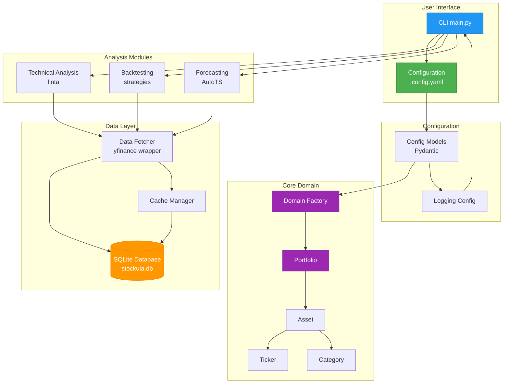
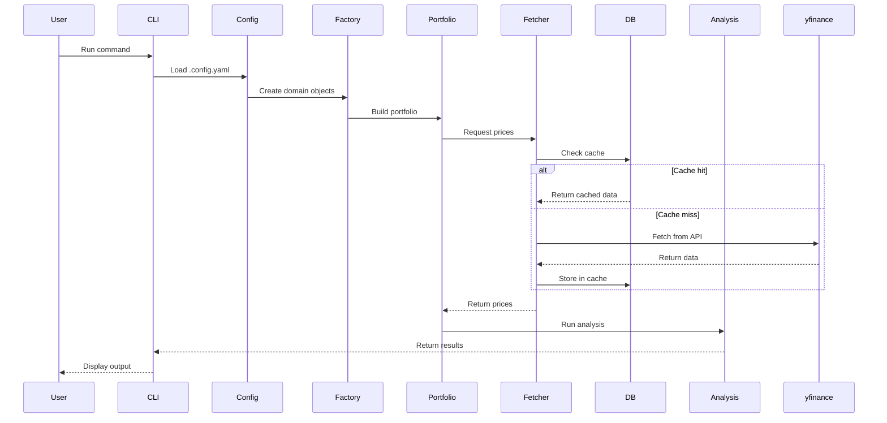

# Stockula

Stockula is a comprehensive Python trading platform that provides tools for technical analysis, backtesting, data fetching, and price forecasting. Built with modern Python practices, it integrates popular financial libraries to offer a complete solution for quantitative trading strategy development.

## Requirements

### System Requirements

- **Python**: 3.13 or higher
- **Operating System**: macOS, Linux, or Windows
- **Memory**: Minimum 8GB RAM recommended
- **Storage**: 100MB free space (more if caching extensive historical data)

### Python Dependencies

- **pandas**: Data manipulation and analysis
- **yfinance**: Yahoo Finance data fetching
- **finta**: Financial technical analysis indicators
- **backtesting**: Strategy backtesting framework
- **autots**: Automated time series forecasting
- **matplotlib**: Plotting and visualization
- **pydantic**: Data validation and settings management
- **pydantic-settings**: Configuration management with environment variable support
- **pyyaml**: YAML file parsing

## Features

- **📊 Technical Analysis**: Calculate popular indicators (SMA, EMA, RSI, MACD, Bollinger Bands, etc.) using the finta library
- **🔄 Backtesting**: Test trading strategies on historical data with detailed performance metrics
- **📈 Data Fetching**: Retrieve real-time and historical market data via yfinance
- **🗄️ SQLite Database**: Automatic caching of all yfinance data with robust lookup capabilities
- **🔮 Price Forecasting**: Automated time series forecasting using AutoTS
- **🚀 Fast Package Management**: Uses uv for lightning-fast dependency management

## Architecture Overview



### Data Flow



## Module Structure

```text
src/stockula/
├── __init__.py           # Main package exports
├── main.py               # CLI demo application
├── config/               # Configuration management
│   ├── __init__.py
│   ├── models.py        # Pydantic models
│   └── settings.py      # Config loading
├── domain/               # Domain models
│   ├── __init__.py
│   ├── portfolio.py     # Portfolio management
│   ├── asset.py         # Asset representation
│   ├── ticker.py        # Ticker & registry
│   ├── category.py      # Category enum
│   └── factory.py       # Domain object factory
├── data/                 # Data fetching module
│   ├── __init__.py
│   └── fetcher.py       # yfinance wrapper with SQLite caching
├── database/             # SQLite database management
│   ├── __init__.py
│   ├── manager.py       # Database operations
│   └── cli.py           # Command-line interface
├── technical_analysis/   # Technical indicators
│   ├── __init__.py
│   └── indicators.py    # finta wrapper
├── backtesting/         # Strategy backtesting
│   ├── __init__.py
│   ├── strategies.py    # Pre-built strategies
│   └── runner.py        # Backtest execution
└── forecasting/         # Price prediction
    ├── __init__.py
    └── forecaster.py    # AutoTS wrapper
```

## Installation

1. Install `uv` (if not already installed):

   ```bash
   curl -LsSf https://astral.sh/uv/install.sh | sh
   ```

1. Clone the repository:

   ```bash
   git clone https://github.com/mkm29/stockula.git
   cd stockula
   ```

1. Install dependencies:

   ```bash
   uv sync
   ```

## Quick Start

### Using Configuration Files

Stockula automatically looks for `.config.yaml`, `.config.yml`, `config.yaml` or `config.yml` in the current directory:

```bash
# Use default configuration file (.config.yaml/.config.yml/config.yaml/config.yml)
uv run python -m stockula.main

# Use a specific configuration file
uv run python -m stockula.main --config config.full.yaml

# Run specific mode with configuration
uv run python -m stockula.main --mode backtest

# Override ticker from configuration
uv run python -m stockula.main --ticker TSLA

# Output as JSON
uv run python -m stockula.main --output json
```

### Command Line Mode

Run without configuration file:

```bash
# Analyze single ticker (uses default settings)
uv run python -m stockula.main --ticker AAPL

# Run specific analysis mode
uv run python -m stockula.main --ticker GOOGL --mode ta
uv run python -m stockula.main --ticker MSFT --mode backtest
uv run python -m stockula.main --ticker AMZN --mode forecast
```

## Usage Examples

### Data Fetching

```python
from stockula import DataFetcher

# Initialize fetcher with database caching (default)
fetcher = DataFetcher(use_cache=True, db_path="stockula.db")

# Get historical data (automatically cached)
data = fetcher.get_stock_data("AAPL", start="2023-01-01", end="2024-01-01")

# Get real-time price
current_price = fetcher.get_realtime_price("AAPL")

# Get company info (cached in database)
info = fetcher.get_info("AAPL")

# Force refresh from yfinance (bypasses cache)
fresh_data = fetcher.get_stock_data("AAPL", force_refresh=True)

# Fetch and store all data types for a symbol
fetcher.fetch_and_store_all_data("AAPL", start="2023-01-01")
```

### SQLite Database Features

Stockula automatically stores all yfinance data in a SQLite database (`stockula.db`) for fast lookups and offline access:

```python
from stockula import DataFetcher, DatabaseManager

# DataFetcher automatically uses database caching
fetcher = DataFetcher()

# First call fetches from yfinance and stores in database
data = fetcher.get_stock_data("AAPL")

# Subsequent calls use cached data (much faster)
cached_data = fetcher.get_stock_data("AAPL")

# Direct database access
db = DatabaseManager("stockula.db")

# Query price history
price_data = db.get_price_history("AAPL", start_date="2023-01-01")

# Get stock information
stock_info = db.get_stock_info("AAPL")

# Get dividends and splits
dividends = db.get_dividends("AAPL")
splits = db.get_splits("AAPL")

# Database statistics
stats = db.get_database_stats()
print(f"Total price records: {stats['price_history']}")

# Clean up old data
db.cleanup_old_data(days_to_keep=365)
```

#### Database CLI Commands

```bash
# Show database statistics
uv run python -m stockula.database.cli stats

# Fetch data for specific symbols
uv run python -m stockula.database.cli fetch AAPL MSFT GOOGL

# Query cached data for a symbol
uv run python -m stockula.database.cli query AAPL

# Clean up old data
uv run python -m stockula.database.cli cleanup --days 365
```

#### Database Schema

The database contains the following tables:

- **stocks**: Basic stock metadata (name, sector, market cap, etc.)
- **price_history**: Historical OHLCV data with configurable intervals
- **dividends**: Dividend payment history
- **splits**: Stock split history
- **options_calls/options_puts**: Options chain data
- **stock_info**: Complete yfinance info as JSON

### Technical Analysis

```python
from stockula import DataFetcher, TechnicalIndicators

# Fetch data
fetcher = DataFetcher()
data = fetcher.get_stock_data("AAPL")
# Note: data contains columns ['Open', 'High', 'Low', 'Close', 'Volume']

# Calculate indicators
ta = TechnicalIndicators(data)

# Get various indicators
sma_20 = ta.sma(period=20)
ema_20 = ta.ema(period=20)
rsi_14 = ta.rsi(period=14)
macd = ta.macd()
bbands = ta.bbands()
```

### Backtesting

```python
from stockula import DataFetcher, BacktestRunner, SMACrossStrategy, RSIStrategy, DoubleEMACrossStrategy, TripleEMACrossStrategy, TRIMACrossStrategy

# Initialize backtest runner
runner = BacktestRunner(cash=10000, commission=0.002)

# Run backtest with SMA crossover strategy
results = runner.run_from_symbol("AAPL", SMACrossStrategy)
print(f"Return: {results['Return [%]']:.2f}%")
print(f"Sharpe Ratio: {results['Sharpe Ratio']:.2f}")
print(f"Max Drawdown: {results['Max. Drawdown [%]']:.2f}%")

# Run with Double EMA Cross strategy (34/55 periods)
results = runner.run_from_symbol("NVDA", DoubleEMACrossStrategy)

# Run with Triple EMA Cross strategy (9/21 periods) - faster signals with less lag
results = runner.run_from_symbol("TSLA", TripleEMACrossStrategy)

# Run with TRIMA Cross strategy (14/28 periods) - smooth trend following
results = runner.run_from_symbol("MSFT", TRIMACrossStrategy)

# Check minimum data requirements for strategies
min_days_double = DoubleEMACrossStrategy.get_min_required_days()
min_days_triple = TripleEMACrossStrategy.get_min_required_days()
min_days_trima = TRIMACrossStrategy.get_min_required_days()
print(f"DoubleEMACross requires at least {min_days_double} trading days")
print(f"TripleEMACross requires at least {min_days_triple} trading days")
print(f"TRIMACross requires at least {min_days_trima} trading days")

# Get recommended start date for a given end date
end_date = "2025-07-25"
start_date = DoubleEMACrossStrategy.get_recommended_start_date(end_date)
print(f"For end date {end_date}, use start date {start_date} or earlier")

# Or with your own data
fetcher = DataFetcher()
data = fetcher.get_stock_data("AAPL", start="2023-01-01")
results = runner.run(data, RSIStrategy)

# Optimize strategy parameters
optimal_params = runner.optimize(
    data,
    SMACrossStrategy,
    fast_period=range(5, 20),
    slow_period=range(20, 50)
)
```

### Price Forecasting

```python
from stockula import StockForecaster

# Initialize forecaster
forecaster = StockForecaster(forecast_length=30)

# Forecast stock prices
predictions = forecaster.forecast_from_symbol("AAPL")

# Get forecast with confidence intervals
print(f"30-day forecast: ${predictions['forecast'].iloc[-1]:.2f}")
print(f"Confidence interval: ${predictions['lower_bound'].iloc[-1]:.2f} - ${predictions['upper_bound'].iloc[-1]:.2f}")
```

## Important Notes

### Data Format

All modules use capitalized column names for OHLCV data:

- `Open`, `High`, `Low`, `Close`, `Volume`

This ensures compatibility with the backtesting library and maintains consistency across all modules.

## Pre-built Strategies

Stockula includes several ready-to-use trading strategies:

- **SMACrossStrategy**: Simple Moving Average crossover strategy
- **RSIStrategy**: Relative Strength Index based strategy
- **MACDStrategy**: MACD (Moving Average Convergence Divergence) strategy
- **DoubleEMACrossStrategy**: Double Exponential Moving Average (34/55) crossover strategy with ATR-based stop losses
  - Requires minimum 75 trading days (55 for slow EMA + 20 buffer)
  - Includes data validation to warn if insufficient data
  - Provides helper methods to calculate required date ranges
- **TripleEMACrossStrategy**: Triple Exponential Moving Average (TEMA) crossover strategy
  - Uses 9/21 period TEMA crossovers for reduced lag
  - Formula: TEMA = 3*EMA - 3*EMA(EMA) + EMA(EMA(EMA))
  - Requires minimum 81 trading days (3\*21-2=61 for slow TEMA + 20 buffer)
  - Includes ATR-based stop losses with 1.5x multiplier
- **TRIMACrossStrategy**: Triangular Moving Average (TRIMA) crossover strategy
  - Uses 14/28 period TRIMA crossovers for smooth trend following
  - Double-smooths data to filter short-term fluctuations
  - Requires minimum 76 trading days (2\*28=56 for slow TRIMA + 20 buffer)
  - Includes ATR-based stop losses with 1.2x multiplier

## Development

### Running Tests

Stockula includes a comprehensive test suite using pytest with fixtures for easy testing. Tests are organized into unit and integration test directories.

```bash
# Run all tests
uv run pytest

# Run only unit tests (fast, no external dependencies)
uv run pytest tests/unit

# Run only integration tests (may require external services)
uv run pytest tests/integration

# Run with coverage report
uv run pytest --cov=stockula

# Run specific test file
uv run pytest tests/unit/test_domain.py
uv run pytest tests/unit/test_strategies.py  # Comprehensive strategy tests
uv run pytest tests/integration/test_database.py

# Run specific test class or function
uv run pytest tests/unit/test_domain.py::TestPortfolio
uv run pytest tests/unit/test_strategies.py::TestAdvancedStrategyExecution
uv run pytest tests/unit/test_domain.py::TestPortfolio::test_portfolio_creation

# Run tests by marker
uv run pytest -m unit          # Only unit tests
uv run pytest -m integration   # Only integration tests
uv run pytest -m "not slow"    # Skip slow tests

# Run tests in parallel (requires pytest-xdist)
uv run pytest -n auto

# Run with verbose output
uv run pytest -v

# Run with minimal output
uv run pytest -q
```

### Test Organization

Tests are organized into two main categories:

#### Unit Tests (`tests/unit/`)

- **test_config.py**: Tests for configuration models and validation
- **test_domain.py**: Tests for domain models (Portfolio, Asset, Ticker, etc.)
- **test_strategies.py**: Comprehensive tests for trading strategies with execution validation
- **test_runner.py**: Tests for backtesting runner functionality
- **test_cli.py**: Tests for database CLI commands and interfaces
- **test_technical_analysis.py**: Tests for technical indicators

These tests run quickly and don't require external services or API calls. All unit tests use proper mocking to avoid external dependencies.

#### Integration Tests (`tests/integration/`)

- **test_data.py**: Tests for data fetching with yfinance
- **test_database.py**: Tests for SQLite database operations
- **test_backtesting.py**: Tests for backtesting strategies
- **test_forecasting.py**: Tests for AutoTS forecasting
- **test_integration.py**: End-to-end integration scenarios
- **test_main.py**: Tests for the main CLI entry point

These tests may be slower and could require network access or database setup.

### Test Coverage

The test suite includes:

- **Unit Tests**: Test individual components in isolation
- **Integration Tests**: Test component interactions and external services
- **Fixtures**: Reusable test data and mock objects in `conftest.py`
- **Mocking**: External API calls are mocked to avoid network dependencies

#### Test Statistics

- **Total Tests**: 340+ tests across unit and integration suites
- **Unit Tests**: 86 strategy tests + additional module tests
- **Current Coverage**: Improved test coverage with comprehensive strategy validation
- **Unit Tests**: All passing, fast execution (< 1 second for strategies)
- **Integration Tests**: May require network/database access

#### Strategy Test Coverage

The strategy test suite includes comprehensive validation:

- **Execution Tests**: All strategies tested with proper mock setups
- **Parameter Validation**: RSI thresholds, ATR parameters, period relationships
- **Data Requirements**: Minimum data calculations and date range validation
- **Error Handling**: Graceful handling of insufficient data and edge cases
- **Performance**: Fast execution with no recursion errors or timeouts

Coverage reports are generated in:

- Terminal: Shows missing lines directly
- HTML: `htmlcov/index.html` - Interactive coverage report
- XML: `coverage.xml` - For CI/CD integration

To improve coverage, run tests with coverage report:

```bash
# Generate detailed coverage report
uv run pytest --cov=stockula --cov-report=html --cov-report=term-missing

# View coverage in browser
open htmlcov/index.html
```

#### Recent Test Improvements

The test suite has been significantly enhanced with:

- **Advanced Strategy Testing**: Fixed recursion issues in strategy tests with proper mock objects
- **Fast Execution**: All tests now run quickly without timeouts (< 1 second for strategy tests)
- **Robust Mocking**: Improved mock setups that avoid infinite recursion and type errors
- **Comprehensive Coverage**: Tests now cover strategy initialization, execution, data validation, and error handling
- **Parameter Validation**: Extensive testing of strategy parameters, thresholds, and data requirements

#### Testing Best Practices

When writing new tests:

1. **Use Proper Mocking**: Create data objects with `__len__` support instead of using `patch('builtins.len')`
1. **Provide Real Values**: Use actual numeric values for strategy attributes instead of Mock objects
1. **Test Edge Cases**: Include tests for insufficient data, empty datasets, and boundary conditions
1. **Fast Execution**: Ensure tests run quickly by avoiding complex setups and external dependencies

### Code Formatting

```bash
uv run ruff format
```

### Linting

```bash
uv run ruff check

# Auto-fix linting issues
uv run ruff check --fix
```

### Type Checking

```bash
# Install mypy if not already installed
uv add --dev mypy

# Run type checking
uv run mypy src/stockula
```

## Troubleshooting

### AutoTS Warnings

When using the forecasting module, you may see template evaluation errors from AutoTS. This is normal behavior as AutoTS tries many different models and some may fail due to:

- Missing optional dependencies (like TensorFlow)
- Data characteristics (single variable, insufficient history)
- Model-specific requirements

The library will automatically skip failed models and use the best performing ones.

### Performance Tips

- For faster backtesting, ensure your data doesn't have unnecessary columns
- Use the `model_list='fast'` parameter in forecasting for quicker results
- Technical indicators are calculated using vectorized operations for efficiency

## Configuration

Stockula uses Pydantic for configuration validation and supports YAML files for easy settings management. By default, Stockula looks for `.config.yaml`, `.config.yml`, `config.yaml` or `config.yml` in the current directory. You can override this with the `--config` flag or the `STOCKULA_CONFIG_FILE` environment variable.

### Configuration Structure

All tickers must be defined as objects with properties and allocation tracking:

```yaml
# Data fetching settings
data:
  start_date: "2023-01-01"
  end_date: null  # defaults to today
  interval: "1d"
  # Ticker objects with properties (required format)
  tickers:
    - symbol: AAPL
      sector: Technology
      market_cap: 3000.0  # billions
      category: large_cap
      allocation_amount: 10000  # dollar allocation
    - symbol: NVDA
      sector: Technology
      category: momentum
      allocation_amount: 5000  # fixed dollar amount

# Portfolio management settings
portfolio:
  initial_capital: 100000
  allocation_method: custom  # equal_weight, market_cap, or custom
  rebalance_frequency: monthly
  max_position_size: 20.0  # max 20% per position
  stop_loss_pct: 10.0  # global stop loss
  
  # Portfolio buckets for organized allocation
  buckets:
    - name: core_holdings
      description: "Long-term core positions"
      allocation_amount: 50000  # $50k allocation
      tickers:
        - symbol: SPY
          allocation_amount: 20000  # $20k
        - symbol: QQQ
          allocation_amount: 15000
        - symbol: VTI
          allocation_amount: 15000
    
    - name: growth_stocks
      description: "High growth technology"
      allocation_amount: 30000  # $30k
      tickers:
        - symbol: NVDA
        - symbol: AMD
        - symbol: GOOGL
        - symbol: META
    
    - name: value_plays
      allocation_amount: 20000  # fixed $20k
      tickers:
        - symbol: BAC
        - symbol: DIS
        - symbol: CVX

# Backtesting settings
backtest:
  initial_cash: 10000.0
  commission: 0.002
  strategies:
    - name: SMACross
      parameters:
        fast_period: 10
        slow_period: 20
    # Example: Double EMA Cross strategy
    # - name: DoubleEMACross
    #   parameters:
    #     fast_period: 34
    #     slow_period: 55
    #     momentum_atr_multiple: 1.25
    #     speculative_atr_multiple: 1.0
    # Example: Triple EMA Cross strategy (faster signals, less lag)
    # - name: TripleEMACross
    #   parameters:
    #     fast_period: 9
    #     slow_period: 21
    #     atr_multiple: 1.5
    # Example: TRIMA Cross strategy (smooth trend following)
    # - name: TRIMACross
    #   parameters:
    #     fast_period: 14
    #     slow_period: 28
    #     atr_multiple: 1.2

# Forecasting settings
forecast:
  forecast_length: 30
  model_list: "fast"
  prediction_interval: 0.95

# Technical analysis settings
technical_analysis:
  indicators: [sma, ema, rsi, macd, bbands, atr]
  sma_periods: [20, 50, 200]
  rsi_period: 14

# Output settings
output:
  format: "console"  # or "json"
  save_results: true
  results_dir: "./results"
```

### Ticker Configuration

All tickers must be defined as objects with the following structure:

```yaml
tickers:
  - symbol: AAPL           # Required: ticker symbol
    sector: Technology     # Optional: market sector
    market_cap: 3000.0     # Optional: market cap in billions
    category: large_cap    # Optional: category (momentum, growth, value, etc.)
    allocation_amount: 5000 # Optional: dollar allocation amount
    price_range:           # Optional: price data
      open: 180.0
      high: 185.0
      low: 178.0
      close: 183.0
```

### Portfolio Allocation

The portfolio configuration supports sophisticated allocation strategies:

- **Equal Weight**: Distribute capital equally across all positions
- **Market Cap Weighted**: Allocate based on market capitalization
- **Custom Allocation**: Define specific dollar amounts

Allocations can be specified at multiple levels:

1. **Individual ticker level**: `allocation_amount` in dollars
1. **Bucket level**: Group related assets and allocate a fixed amount to the bucket
1. **Portfolio level**: Overall allocation strategy

Example with multi-level allocation:

```yaml
portfolio:
  initial_capital: 100000
  allocation_method: custom
  buckets:
    - name: tech_growth
      allocation_amount: 60000  # $60k to this bucket
      tickers:
        - symbol: NVDA
          allocation_amount: 24000  # $24k
        - symbol: AMD
          allocation_amount: 18000  # $18k
        - symbol: GOOGL
          allocation_amount: 18000  # $18k
```

### Environment Variables

You can override settings using environment variables:

```bash
export STOCKULA_CONFIG_FILE=my_config.yaml
export STOCKULA_DEBUG=true
export STOCKULA_LOG_LEVEL=DEBUG
```

### Creating Custom Configurations

```python
from stockula import StockulaConfig, load_config

# Load from file
config = load_config("my_config.yaml")

# Create programmatically
from stockula.config import DataConfig, BacktestConfig

config = StockulaConfig(
    data=DataConfig(tickers=["AAPL", "GOOGL"]),
    backtest=BacktestConfig(initial_cash=50000)
)
```

## Forecasting

Stockula uses AutoTS for time series forecasting, which automatically tests multiple models to find the best fit for your data.

### Important Notes on Forecasting

When running forecast mode, please be aware:

- **AutoTS is verbose**: The library tests many models and outputs errors for those that don't fit well. This is normal behavior.
- **Process can take time**: Depending on your settings, forecasting can take several minutes per ticker.
- **Use Ctrl+C to cancel**: The process now handles interrupts gracefully.

### Optimizing Forecast Performance

To speed up forecasting and reduce verbosity:

```yaml
forecast:
  forecast_length: 14      # Shorter forecasts are faster
  model_list: "fast"       # Use only fast models
  max_generations: 2       # Reduce from default 5
  num_validations: 1       # Reduce from default 2
  ensemble: "simple"       # Simple is faster than auto
```

### Running Forecasts

The correct command syntax is:

```bash
# Correct - using Python module syntax
uv run python -m stockula.main --config .config.yaml --mode forecast

# Test with minimal configuration
uv run python test_forecast.py
```

### Troubleshooting Forecasts

If forecasting is taking too long or producing too many errors:

1. **Enable logging** to see progress:

   ```yaml
   logging:
     enabled: true
     level: "INFO"
   ```

1. **Use faster settings** as shown above

1. **Test with single ticker** first:

   ```bash
   uv run python -m stockula.main --ticker AAPL --mode forecast
   ```

1. **Check data availability**: Ensure the ticker has sufficient historical data

## License

MIT License - see LICENSE file for details

## Contributing

Contributions are welcome! Please feel free to submit a Pull Request.
