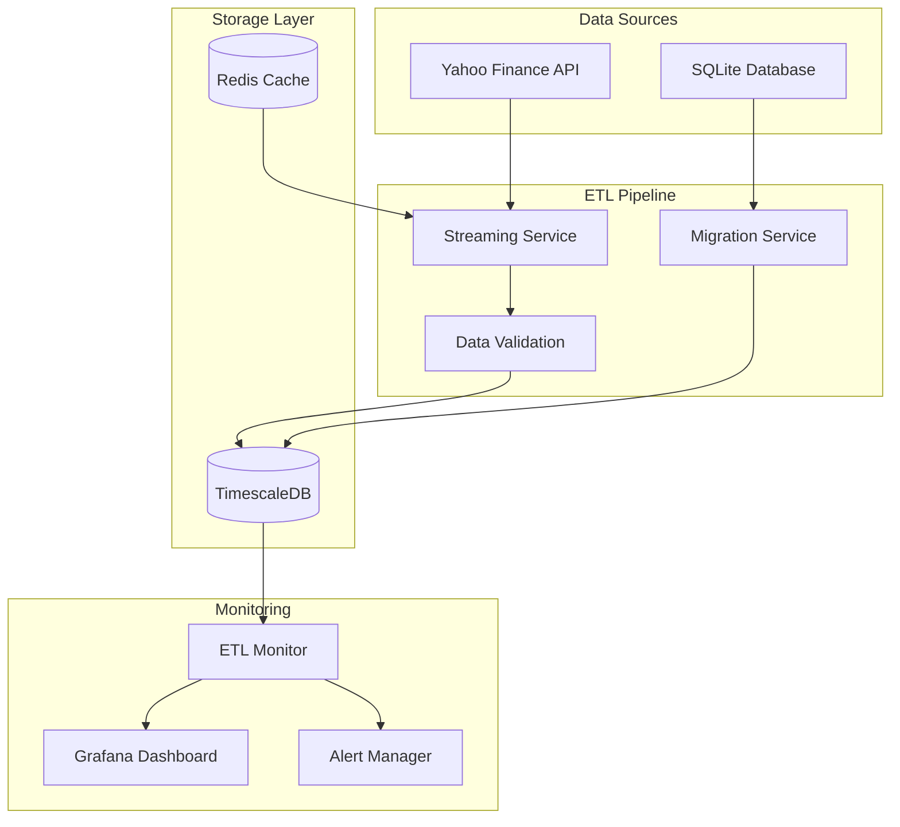

# Stockula ETL Pipeline Deployment Guide

This directory contains everything needed to deploy the Stockula ETL pipeline for immediate production use, including
data migration from SQLite to TimescaleDB and real-time streaming infrastructure.

## Quick Start

### Prerequisites

1. **Docker & Docker Compose**: Ensure Docker is installed and running
1. **Minimum 10GB disk space**: For database, logs, and containers
1. **Minimum 8GB RAM**: For optimal performance (16GB recommended)
1. **Network access**: For Yahoo Finance API calls

### Immediate Deployment

```bash
# Clone or navigate to the repository
cd stockula/deploy

# Run the automated deployment script
./scripts/deploy.sh

# Follow the prompts for monitoring and admin tools
```

The deployment script will:

- ✅ Set up TimescaleDB with optimized configuration
- ✅ Migrate existing SQLite data (if present)
- ✅ Start real-time streaming pipeline
- ✅ Configure monitoring and alerting
- ✅ Optimize database performance
- ✅ Set up health checks

## Architecture Overview



## Services

### Core Services

| Service        | Port | Description                                    |
| -------------- | ---- | ---------------------------------------------- |
| TimescaleDB    | 5432 | Primary database with time-series optimization |
| Redis          | 6379 | Caching and session management                 |
| ETL Streaming  | -    | Real-time data ingestion from Yahoo Finance    |
| ETL Monitoring | 8080 | Health checks and performance metrics          |

### Optional Services

| Service    | Port | Description              |
| ---------- | ---- | ------------------------ |
| Grafana    | 3000 | Visualization dashboards |
| Prometheus | 9090 | Metrics collection       |
| pgAdmin    | 8081 | Database administration  |

## Configuration

### Environment Variables

Critical settings in `deploy/.env`:

```bash
# Database Credentials (CHANGE THESE!)
POSTGRES_PASSWORD=your_secure_password
ETL_PASSWORD=etl_secure_password
ANALYST_PASSWORD=analyst_secure_password

# Admin Interface Passwords
GRAFANA_PASSWORD=grafana_password
PGADMIN_PASSWORD=pgadmin_password
```

### ETL Configuration

Main configuration in `deploy/config/etl_config.yaml`:

```yaml
timescaledb:
  host: timescaledb
  database: stockula
  pool_size: 20

migration:
  batch_size: 50000      # Optimized for speed
  parallel_workers: 8    # Parallel processing

streaming:
  fetch_interval: 30     # 30-second updates
  batch_size: 2000       # Large batches for efficiency
  worker_count: 4        # Multiple workers

validation:
  null_threshold: 0.02   # Strict data quality
  max_price_change: 0.3  # 30% daily limit
```

## Performance Optimization

The ETL pipeline includes several performance optimizations:

### Database Level

- **Hypertables**: Automatic time-based partitioning
- **Compression**: 7-day compression policy (90%+ space savings)
- **Indexes**: Optimized for time-series queries
- **Connection Pooling**: 20 connections with overflow

### ETL Level

- **Bulk Operations**: PostgreSQL COPY for maximum throughput
- **Parallel Processing**: Multi-worker architecture
- **Batching**: Configurable batch sizes for optimal performance
- **Caching**: Redis for frequently accessed data

### Monitoring

- **Real-time Metrics**: Performance tracking and alerting
- **Health Checks**: Automated service monitoring
- **Error Handling**: Retry logic with exponential backoff

## Data Migration

### Automatic Migration

If you have an existing `stockula.db` file:

```bash
# Place your SQLite file in the project root
cp path/to/your/stockula.db ./stockula.db

# Run deployment (migration happens automatically)
./scripts/deploy.sh
```

### Manual Migration

```bash
# Run migration only
docker compose run --rm etl-migration \
  python -m stockula.etl.cli migrate \
  --config /app/config/etl_config.yaml \
  --verify
```

### Migration Performance

Expected throughput (varies by hardware):

- **Stocks metadata**: ~10,000 records/second
- **Price history**: ~50,000 records/second
- **Options data**: ~25,000 records/second

Large datasets (>1M records) benefit from parallel processing.

## Real-time Streaming

### Data Sources

- **Yahoo Finance**: Primary source for real-time market data
- **Fetch Interval**: 30 seconds (configurable)
- **Symbols**: Auto-detected from database or manually specified

### Pipeline Features

- **Batch Processing**: Groups updates for efficiency
- **Data Validation**: Quality checks before storage
- **Error Handling**: Retry logic and dead letter queue
- **Monitoring**: Real-time performance metrics

### Starting Streaming

```bash
# Start streaming with default configuration
docker compose up -d etl-streaming

# Monitor streaming performance
curl http://localhost:8080/health

# View streaming logs
docker compose logs -f etl-streaming
```

## Monitoring & Alerting

### Built-in Monitoring

Access monitoring dashboard at: http://localhost:8080

Key metrics:

- **Records processed per second**
- **Data validation success rate**
- **Database performance**
- **System resource usage**

### Custom Alerts

Default alert rules:

- High CPU usage (>80%)
- Memory usage (>85%)
- Processing stalled (\<1 record/sec)
- High error rate (>5%)

### Grafana Dashboards

If enabled during deployment:

- **TimescaleDB Performance**: Database metrics
- **ETL Pipeline Status**: Processing rates and errors
- **System Resources**: CPU, memory, disk usage

## Troubleshooting

### Common Issues

**Migration fails with connection error:**

```bash
# Check TimescaleDB status
docker compose exec timescaledb pg_isready -U postgres

# Restart if needed
docker compose restart timescaledb
```

**Streaming stops receiving data:**

```bash
# Check Yahoo Finance connectivity
docker compose exec etl-streaming curl -s "https://query1.finance.yahoo.com/v8/finance/chart/AAPL"

# Restart streaming service
docker compose restart etl-streaming
```

**High memory usage:**

```bash
# Reduce batch sizes in config/etl_config.yaml
migration:
  batch_size: 10000  # Reduce from 50000
streaming:
  batch_size: 500    # Reduce from 2000
```

### Log Analysis

```bash
# View all service logs
docker compose logs

# Specific service logs
docker compose logs etl-streaming
docker compose logs timescaledb

# Follow logs in real-time
docker compose logs -f --tail=100
```

### Performance Tuning

**For high-volume environments:**

1. **Increase worker counts**:

```yaml
migration:
  parallel_workers: 16  # More CPU cores
streaming:
  worker_count: 8       # More concurrent processing
```

2. **Optimize database settings**:

```yaml
timescaledb:
  pool_size: 50         # More connections
  max_overflow: 100     # Higher overflow
```

3. **Tune batch sizes**:

```yaml
migration:
  batch_size: 100000    # Larger batches
streaming:
  batch_size: 5000      # More records per batch
```

## CLI Operations

### Available Commands

```bash
# General status
docker compose run --rm etl-migration python -m stockula.etl.cli status

# Run migration manually
docker compose run --rm etl-migration python -m stockula.etl.cli migrate \
  --config /app/config/etl_config.yaml

# Start streaming manually
docker compose run --rm etl-streaming python -m stockula.etl.cli stream \
  --config /app/config/etl_config.yaml

# Database optimization
docker compose run --rm etl-migration python -m stockula.etl.cli optimize \
  --config /app/config/etl_config.yaml --full

# Data validation
docker compose run --rm etl-migration python -m stockula.etl.cli validate \
  --config /app/config/etl_config.yaml

# Generate config template
docker compose run --rm etl-migration python -m stockula.etl.cli config-template \
  --output /app/config/new_config.yaml
```

## Production Deployment

### Security Checklist

- [ ] Change all default passwords in `.env`
- [ ] Use strong database passwords (>20 characters)
- [ ] Enable SSL for database connections (if needed)
- [ ] Configure firewall rules for exposed ports
- [ ] Set up log rotation to prevent disk fill
- [ ] Configure backup strategy for TimescaleDB

### Backup Strategy

```bash
# Database backup
docker compose exec timescaledb pg_dump -U postgres stockula > backup.sql

# Restore from backup
docker compose exec -T timescaledb psql -U postgres stockula < backup.sql

# Automated backups (add to cron)
0 2 * * * cd /path/to/deploy && docker compose exec timescaledb pg_dump -U postgres stockula | gzip > backups/stockula_$(date +\%Y\%m\%d).sql.gz
```

### Scaling Considerations

**Horizontal Scaling:**

- Use TimescaleDB distributed hypertables for >10TB datasets
- Deploy multiple streaming workers across nodes
- Implement database connection pooling (PgBouncer)

**Vertical Scaling:**

- Increase memory allocation for TimescaleDB
- Add more CPU cores for parallel processing
- Use faster storage (NVMe SSDs) for better I/O

## Support

### Getting Help

1. **Check logs first**: `docker compose logs [service]`
1. **Review health status**: `curl http://localhost:8080/health`
1. **Validate configuration**: Use CLI validation commands
1. **Monitor resources**: Check CPU, memory, and disk usage

### Configuration Examples

See `config/examples/` for:

- High-volume deployment settings
- Development environment configs
- Custom validation rules
- Advanced monitoring setups

______________________________________________________________________

**Ready for immediate production deployment with enterprise-grade performance and monitoring!**
