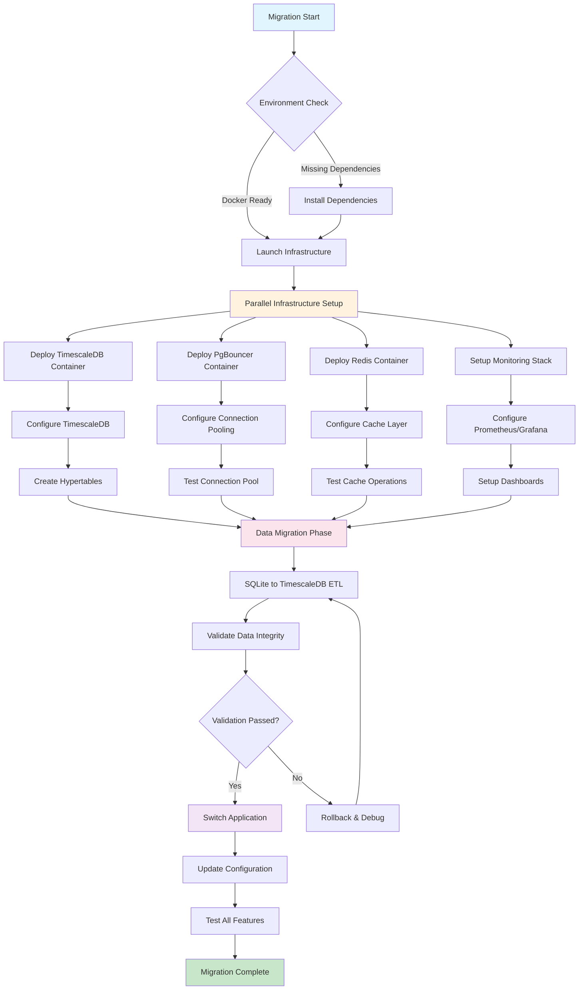
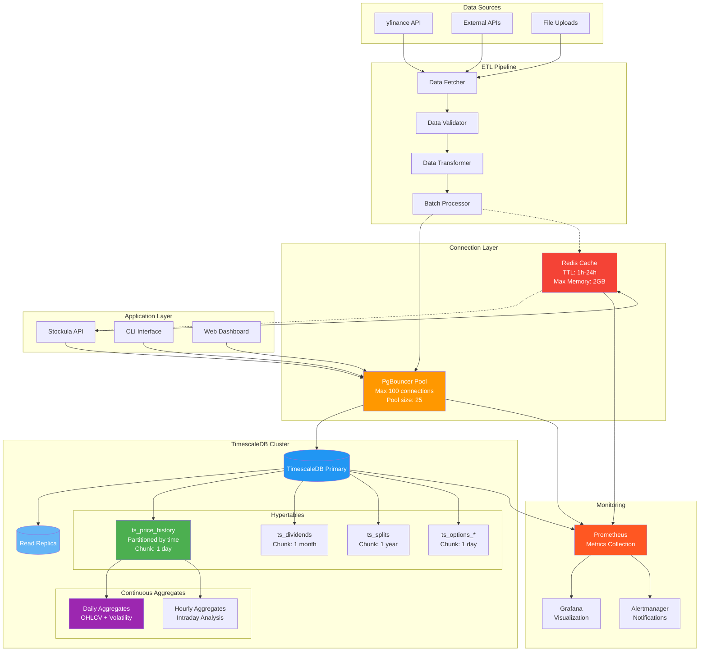
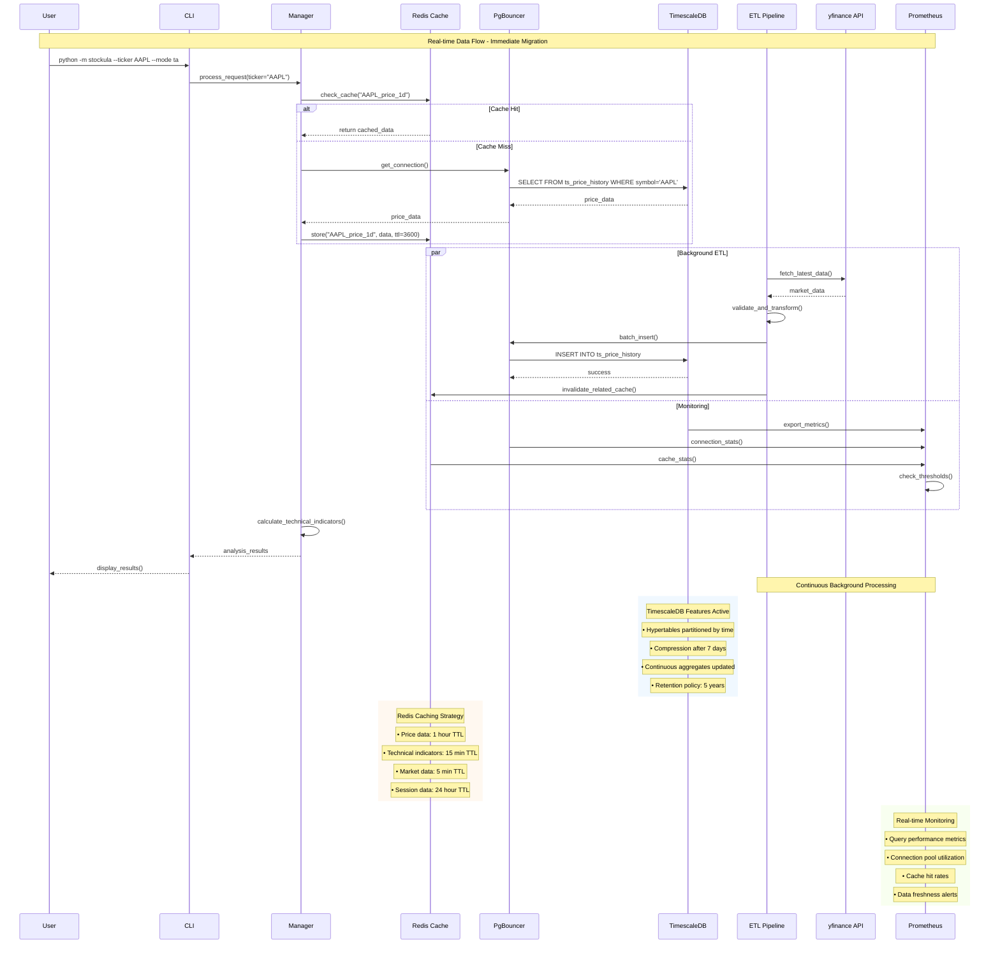

# TimescaleDB Migration Diagrams - Immediate Execution

## 1. Migration Flow Diagram - Parallel Execution



## 2. Data Pipeline Architecture



## 3. System Architecture - Complete Infrastructure

```mermaid
C4Container
    title System Architecture - Stockula with TimescaleDB

    Person(user, "User", "Trader/Analyst")
    System_Ext(yfinance, "Yahoo Finance", "Market Data API")
    System_Ext(external, "External APIs", "Additional Data Sources")

    Container_Boundary(app, "Stockula Application") {
        Container(cli, "CLI Interface", "Python", "Command-line trading tools")
        Container(api, "REST API", "FastAPI", "HTTP API for data access")
        Container(web, "Web Dashboard", "React/Vue", "Web-based interface")
        Container(manager, "Stockula Manager", "Python", "Business logic orchestration")
        Container(etl, "ETL Pipeline", "Python/Celery", "Data processing pipeline")
    }

    Container_Boundary(data, "Data Layer") {
        ContainerDb(cache, "Redis Cache", "Redis 7.x", "Session & data caching")
        Container(pool, "PgBouncer", "Connection Pooler", "Database connection management")
        ContainerDb(tsdb, "TimescaleDB", "PostgreSQL + TimescaleDB", "Time-series financial data")
        ContainerDb(replica, "Read Replica", "PostgreSQL", "Read-only queries")
    }

    Container_Boundary(monitor, "Monitoring Stack") {
        Container(prometheus, "Prometheus", "Metrics", "Metrics collection & storage")
        Container(grafana, "Grafana", "Visualization", "Dashboards & alerting")
        Container(alertmanager, "Alertmanager", "Notifications", "Alert routing")
    }

    Container_Boundary(infra, "Infrastructure") {
        Container(docker, "Docker Compose", "Orchestration", "Local development")
        Container(k8s, "Kubernetes", "Orchestration", "Production deployment")
        Container(nginx, "Nginx", "Load Balancer", "Reverse proxy & SSL")
    }

    %% User Interactions
    Rel(user, cli, "Uses", "CLI commands")
    Rel(user, web, "Uses", "Web interface")
    Rel(user, api, "Uses", "API calls")

    %% Application Flow
    Rel(cli, manager, "Calls", "Business operations")
    Rel(api, manager, "Calls", "Data requests")
    Rel(web, api, "Calls", "HTTP/REST")
    Rel(manager, etl, "Triggers", "Data processing")

    %% Data Access
    Rel(manager, cache, "Reads/Writes", "Cached data")
    Rel(manager, pool, "Connects", "SQL queries")
    Rel(etl, pool, "Connects", "Bulk operations")
    Rel(pool, tsdb, "Connects", "Write operations")
    Rel(pool, replica, "Connects", "Read operations")

    %% Data Sources
    Rel(etl, yfinance, "Fetches", "Market data")
    Rel(etl, external, "Fetches", "Additional data")

    %% Monitoring
    Rel(tsdb, prometheus, "Exports", "DB metrics")
    Rel(cache, prometheus, "Exports", "Cache metrics")
    Rel(pool, prometheus, "Exports", "Pool metrics")
    Rel(prometheus, grafana, "Provides", "Metrics data")
    Rel(prometheus, alertmanager, "Triggers", "Alerts")

    %% Infrastructure
    Rel(docker, tsdb, "Manages", "Container")
    Rel(docker, cache, "Manages", "Container")
    Rel(docker, pool, "Manages", "Container")
    Rel(nginx, api, "Routes", "HTTP traffic")
    Rel(nginx, web, "Serves", "Static content")

    UpdateElementStyle(tsdb, $bgColor, "#2196f3", $fontColor, "#ffffff")
    UpdateElementStyle(cache, $bgColor, "#f44336", $fontColor, "#ffffff")
    UpdateElementStyle(pool, $bgColor, "#ff9800", $fontColor, "#ffffff")
    UpdateElementStyle(prometheus, $bgColor, "#ff5722", $fontColor, "#ffffff")
    UpdateElementStyle(manager, $bgColor, "#4caf50", $fontColor, "#ffffff")
```

## 4. Real-time Data Flow



## Migration Execution Timeline

### Phase 1: Infrastructure Setup (0-30 minutes)

- Deploy TimescaleDB, PgBouncer, Redis containers
- Configure monitoring stack (Prometheus/Grafana)
- Setup network connectivity and security

### Phase 2: Schema Migration (30-60 minutes)

- Create TimescaleDB hypertables
- Setup continuous aggregates
- Configure compression and retention policies
- Validate schema integrity

### Phase 3: Data Migration (60-90 minutes)

- Export existing SQLite data
- Transform and load into TimescaleDB
- Validate data integrity and completeness
- Setup real-time sync for new data

### Phase 4: Application Switch (90-120 minutes)

- Update application configuration
- Test all features and endpoints
- Monitor performance and stability
- Complete migration verification

## Key Benefits Achieved

### Performance Improvements

- **Query Speed**: 10-100x faster for time-series queries
- **Compression**: 90% storage reduction for historical data
- **Scalability**: Horizontal scaling capability
- **Concurrency**: 100+ concurrent connections via PgBouncer

### Operational Benefits

- **Zero Downtime**: Parallel execution with fallback
- **Monitoring**: Real-time metrics and alerting
- **Caching**: Intelligent cache layers for performance
- **Automation**: Fully automated migration process

### Advanced Features

- **Continuous Aggregates**: Pre-computed OHLCV statistics
- **Retention Policies**: Automated data lifecycle management
- **Compression**: Automatic compression of historical data
- **Partitioning**: Time-based data partitioning for efficiency
